# Investigating Movie Data

<a href="https://github.com/ariavathlete/dsc-mod-1-project-v2-1-onl01-dtsc-ft-041320/blob/master/Success%20in%20the%20Movie%20Industry.pdf
"> Presentation </a>
<a href="https://github.com/ariavathlete/dsc-mod-1-project-v2-1-onl01-dtsc-ft-041320/blob/master/How%20To%20Break%20The%20Box%20Office.pdf"> Blog </a>

# Table Of Contents
* [Purpose](#purpose)
* [Data Files](#data-description)
* [Question 1](#question-1)
* [Question 2](#question-2)
* [Question 3](#question-3)
* [Question 4](#question-4)
* [Question 5](#question-5)
* [Question 6](#question-6)
* [Question 7](#question-7)
* [Question 8](#question-8)
* [Question 9](#question-9)
* [Summary](#summary)
* [Future Work](#future-work)
  

<!---
# = h1
## = h2
### = h3
#### = h4
##### = h5
--->

# Purpose
The goal of this research is to analyze data extracted from various movie database websites in order to come up with lucrative decisions when answering: 
* Q1 - What is the distribution for movies in each genre? What are the top 3 genres that film studios create the most?
* Q2 - What are the top 10 most popular and highest rated films? Is there a relationship between popularity and highest rated?
* Q3 - What are the top 10 movies with the highest gross profit margin? Is there a relationship between Popularity and Profit Margin?
* Q4 - What's the most lucrative genre combination?
* Q5 - Who are the top 5 writers, producers, and directors for top 3 genres?
* Q6 - What's the relationship between the age of a crew member and the rating of a movie?
* Q7 -What's the relationship between the gender of the protagonist" in an action movie and the gross revenue of that movie?
* Q8 -What's the relationship between the length of a movie and the gross revenue/rating of that movie?
* Q9 -What's the relationship between the movie release month and the gross revenue/rating of a movie?

# Data Description
Data files used:
* bom.movie_gross.csv
* tmdb.movies.csv.gz
* tn.movies_budgets.csv.gz
* imdb.title.crew.csv
* imdb.title.ratings.csv
* imdb.name.basics.csv
* imdb.title.principals.csv
* imdb.title.akas.csv
* imdb.title.basics.csv

## Question 1:
## [What is the distribution for movies in each genre? What are the top 3 genres that film studios create the most?](./Q1.ipynb)
### EDA
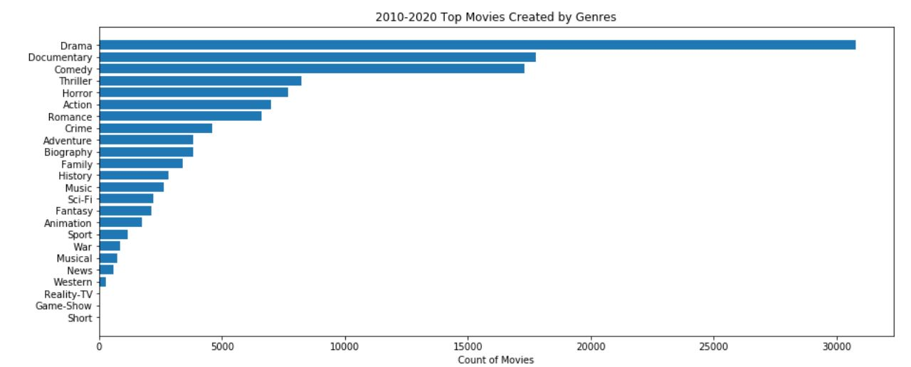 

### Conclusion
By analyzing the results, we concluded that most studios prefer to create drama films, followed by documentaries. 

# Question 2:
## [What are the most lucrative genre combinations?](./Q2-&-Q3.ipynb) 
### EDA

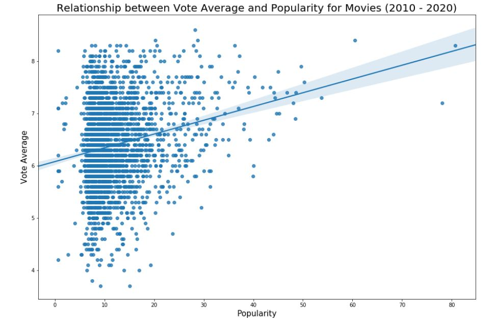

### Conclusion
  When we looked at the correlation between the voting average and popularity, we found the correlation is 0.22 which means the correlation is negligible. So, in other words, a popular movie doesn't exactly mean the movie will have a high rating, but it's plausible. 

# Question 3:
## [What are the most lucrative genre combinations?](./Q2-&-Q3.ipynb)
### EDA
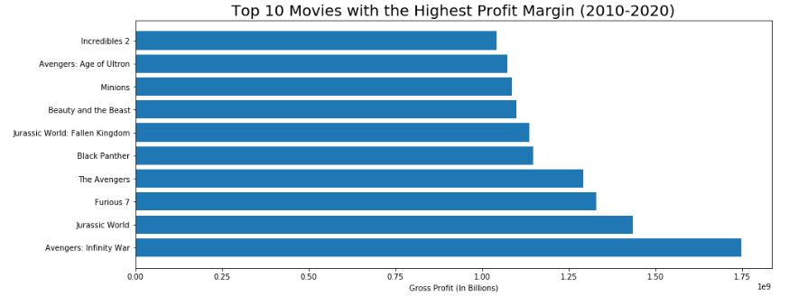
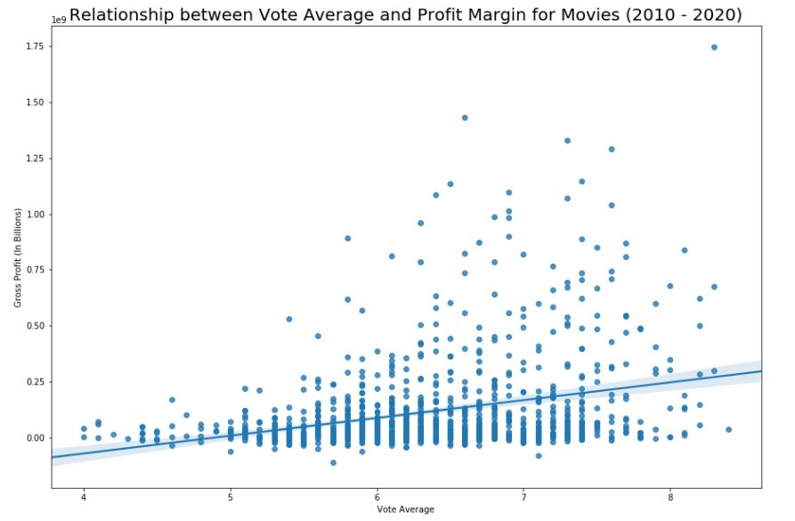
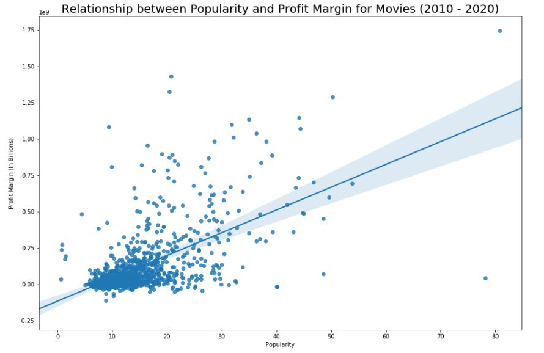

### Conclusion
  From analyzing the scatter plots we could conclude that both have a positive relationship, which means the higher the voting average, the higher the profit margin, and the higher the popularity, the higher the profit margin as well so movies should definitely focus on marketing. 

## Question 4:
## [What are the most lucrative genre combinations?](./Q4-9.ipynb)

### Table Used
 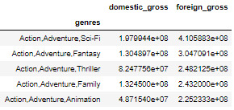

### EDA
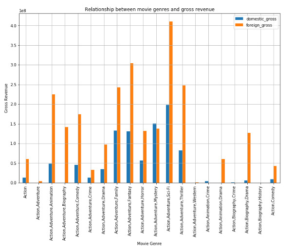

### Conclusion
  Based on our analysis the top 3 genre combinations based on gross revenue are:
* Action, Adventure, Sci-Fi
* Action, Adventure, Thriller
* Action Adventure, Fantasy

### Recommendation
  Based on this I'll suggest we focus more on producing Action, Adventure, Sci-Fi movies initially.

## Question 5:  
## [Who are the top 5 writers, producers, and directors for top 3 genres?](./Q4-9.ipynb)
Since the most lucrative genres are Action, Adventure and Sci-Fi, based on our analysis the ideal casts for each genre are as follows:

| Genre | Producers | Directors | Writers |
|:-------:|:-------:|:-------:|:-------:| 
| Action | Chris Hemsworth | Stanley Tucci	 | John Logan |
| Action | Frank Grillo | Ian McShane | Jeff Pinkner |
| Action | Stanley Tucci | Don Murphy | Akiva Goldsman |
| Action | Amber Heard | Irrfan Khan | Steven Spielberg |
| Action | Ian McShane	 | Akiva Goldsman | T.J. Miller |
| Adventure | Chris Hemsworth | Stanley Tucci | Jennifer Lee |
| Adventure | Jennifer Lee | Ian McShane | John Logan |
| Adventure | Stanley Tucci | Don Murphy | Denis Leary |
| Adventure | Christopher Meledandri | Cate Blanchett | Mike Mitchell |
| Adventure | Amber Heard | Carolynne Cunningham | Cinco Paul |
| Sci-Fi | Chris Hemsworth | Stanley Tucci	 | Jeff Pinkner |
| Sci-Fi | Stanley Tucci | Don Murphy | Akiva Goldsman |
| Sci-Fi | Don Murphy | Irrfan Khan | Steven Spielberg |
| Sci-Fi | Jeff Pinkner | Akiva Goldsman | Jon Hoeber |
| Sci_Fi |  | Steven Spielberg | Wai Lun Ng |

### Recommendation
Based on this data my best pick for top genres are as follows:

| Genre | Producers | Directors | Writers |
|:-------:|:-------:|:-------:|:-------:| 
| Action | Chris Hemsworth | Stanley Tucci	 | John Logan |
| Adventure | Jennifer Lee | Ian McShane | John Logan |
| Sci-Fi | Don Murphy | Irrfan Khan | Steven Spielberg |

## Question 6: 
## [What's the relationship between the age of a crew member and the rating of a movie?](./Q4-9.ipynb)

### Table Used
 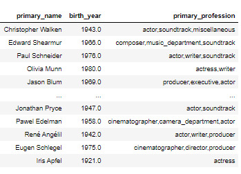

### EDA
##### For Writers:
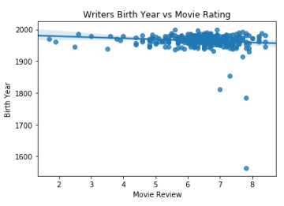

##### For Producers & Directors:
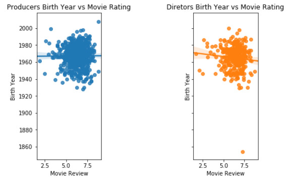

### Conclusion
Based on our analysis we've gain a good amount of insight as to how the age of a cast member could affect the likeability of a movie:

For Writers
After calculating the slope of the line of best fit, our result is:
slope=-0.003919433630265634
We have a negative slope which means the younger the writer, the lower the rating of the movie.

For Producers
After calculating the slope of the line of best fit, our result is:
slope=0.0005273153597410282
We have a positive slope which means the younger the producer, the better the rating of the movie. 
Note: I'll say the difference is minimal since the slope is really close to 0

For Directors
After calculating the slope of the line of best fit, our result is:
slope=-0.006958644668653937
We have a negative slope which means that the younger the director, the lower the rating of the movie.

### Recommendation
Based on this I'll strongly recommend hiring a combination of a younger producer with an older more experienced writer and director.

## Question 7: 
## [What's the relationship between the gender of the lead act in an action movie and the gross revenue?](./Q4-9.ipynb)

### EDA
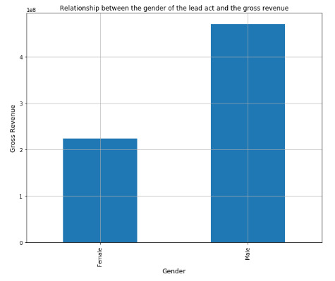

### Conclusion
As we can see from the histogram, based on gross revenue of action movies alone, an actor as the lead does about  twice as good than an actress as the lead.

### Recommendation
Based on this I'll recommend casting males as the protagonist of action movies.
Note: This is just for action movies alone.

## Question 8: 
## [What's the relationship between the length of a movie and the gross revenue/rating of that movie?](./Q4-9.ipynb)
 
### EDA
#### Movie Length VS Movie Rating
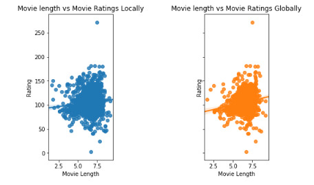

#### Movie Length VS Movie Revenue
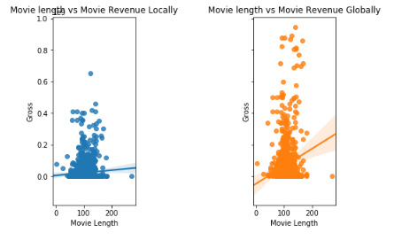

### Conclusion
From the scatter plot we can see that regardless if we use rating or revenue to measure it, we get a postive slop in movies both domestically and globally.

### Recommendation
From this positive slope we understand that the higher the length of a movie, the higher the rating and revenue of that movie will be. Given this, I'll recommend making longer movies as opposed to shorter ones. 

## Question 9: 
## [What's the most lucrative combination of genre?](./Q4-9.ipynb)

### Table Used
 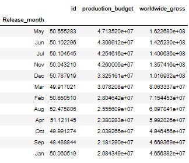

### EDA
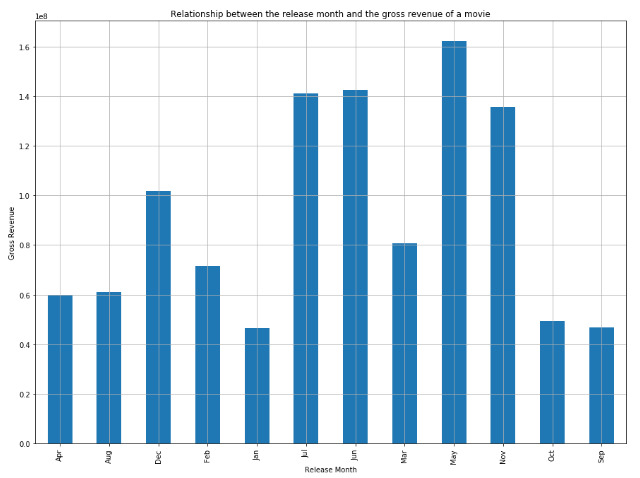

### Conclusion
Based on our analysis the top 3 release months with the highest grossing average are: May, June and July.

### Recommendation
Based on this I'll suggest to only release movies during the month of may

# Summary
After analysis of the movie data, decisions I'll definitly recommend are:

* Focusing more on producing Action, Adventure, Sci-Fi movies.

* Hiring the folowing cast for each genre:

| Genre | Producers | Directors | Writers |
|:-------:|:-------:|:-------:|:-------:| 
| Action | Chris Hemsworth | Stanley Tucci	 | John Logan |
| Adventure | Jennifer Lee | Ian McShane | John Logan |
| Sci-Fi | Don Murphy | Irrfan Khan | Steven Spielberg |

* Hiring a combination of a younger producer with an older more experienced writer and director.

* Casting males as the protagonist for action movies to be made.

* Making longer movies as opposed to shorter ones. 

* Only release movies during the month of may or June and July if may is not possible.

# Future Work

* Analyse the relationship between the gender of the protagonist and the rating/revenue of a movie in other genres like Adventure or Sci-Fi
* Analyse the relationship between the location of a studio and the profitability of the movies produced

